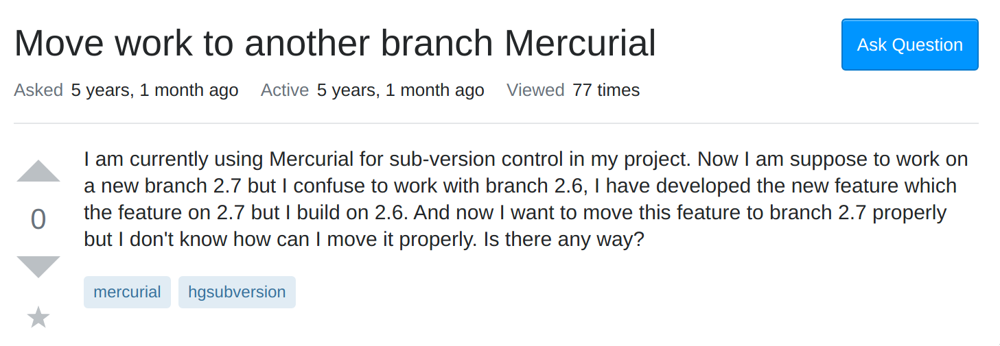

Recently, one of our assignments was to read an essay called "How to ask questions the smart way". After reading the essay, I'd say the saying "help me help you" describes it in the most concise, elegant, and most efficient way possible. It establishes an entire process that one must go through before asking any question at all. The preliminary conditions that one must go through involve searching the web for any similar questions that were asked, and seeing if those would provide the desired solution. Combing through existing documentation, FAQs, experimenting for a solution, or even asking a friend are all things that one can do to see if they can find the answer to the question. Then, if and only if one cannot find the answer that they are looking for, then they can try to ask their question, with certain conditions. The person asking the questions must demonstrate that they have tried searching for a solution on their own, and also show that they are not just expecting the answer to just be given to them in plain sight. The objective is to get guidance from the community to point you in the right direction.

## Using your resources
Whenever we get stuck with our code, Stack Overflow is usually the first site that appears when we start searching the big wide world of the internet for help. The website is full of lots of questions from both aspiring young programmers, to seasoned industry veterans, all aiming to provide assistance, or to request assistance from their fellow eggheads. Although fellow members of the community are more than happy to help each other, utilizing the tips in the essay can ensure that someone may come around with the exact solution you are looking for. Including more information, and being as detailed as possible significantly increases those chances as well.

Here's an example of a pretty good question that was asked.

Taking a few qualities from the essay, we can see that the question this person is asking is off to a good start, as the issue that they are experiencing has been established in the title. Then, we also see the inclusion of source code and error messages that appear as well to further describe the issue. The OP (original poster) also describes their issue concisely at the beginning of the question as well, making their intentions clear as to what they are trying to accomplish. They also include the exact thing that they are looking for, instead of saying "please help me!!!!" like many questions end with.

Here's another example of a question that might not make the cut of a smart question.

This question doesn't really fit the bill of what a smart question would have. The title itself isn't really gramatically understandable, and the person asking the question didn't really give off the impression that they did much research. Not knowing how to do something can be alright, as we are all still learning, but there needs to be some effort in learning the thing that you are having trouble with by reading existing documentation, or possibly researching the issue if it has been experienced before.

And, as expected, we get the famous RTFM answer here..

Which tells us that the answer was found in some kind of documentation of whatever technology/system that the person was using.

## You get what you give

After reading the essay, I was able to say that I have seen and experienced a majority of the phenomenon first hand. I've been getting into Linux recently by installing Arch Linux, and have been starting to warm up to the idea of terminal/vim-based applications as they have proved to be extremely efficient for a few things. The 'man' command in Linux provides a full, detailed manual of all the possible commands that the particular application has. The Arch Linux Wiki is also said to have the best documentation on almost all kinds of major Linux utilities. The Arch Linux forums also strictly adhere to the smart question format, as those that answer almost always reference the documentation in their answers, and are always asking for configuration outputs to ensure that settings are properly configured. Like the Stack Overflow examples, the best thing to do is to include as much detail as possible, and stating anything and everything that you have tried already.

Having some early practice on the Arch Linux forums will definitely help me with answering smart questions, and solidifies the fact that you can never overcommunicate the details of your issue. I will definitely be using the methods of asking smart questions that I have learned over the years, and from reading the paper, and will do my best to apply them effectively in my software engineering career.

