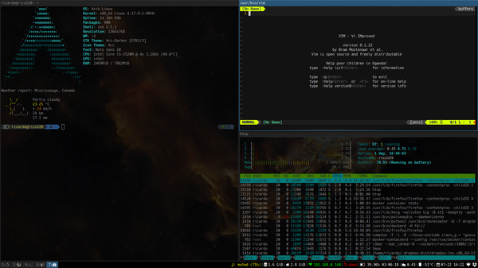

 ## We've all been there.
 If I had a dollar for every time that someone asked a question in class that cound be answered by either looking at an announcement, schedule, course website, email, or the syllabus, then I'd probably have enough money for a few textbooks that I could purchase (which is probably the equivalent of, like a million dollars or something like that) instead of "acquiring" the copy of it online. Although that analogy seems like hyperbole, there have been numerous times where someone asks something that can be found in another resource, and just wastes everyone's time by making the person that the question is asked to repeat themselves. In most cases, those types of questions are not typically answered by the person saying "look in the (insert reference material here)", as those types of responses come off as rude or mean in the generation of the "special snowflake". 
