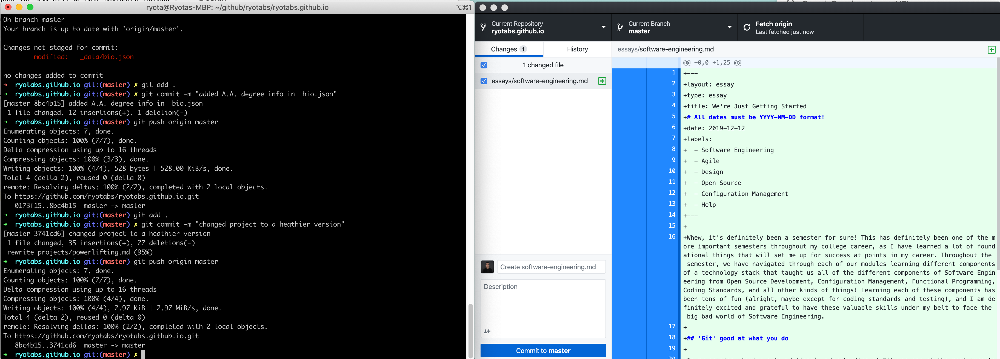

Whew, it's definitely been a semester for sure! This has definitely been one of the more important semesters throughout my college career, as I have learned a lot of foundational things that will set me up for success at points in my career. Throughout the semester, we have navigated through each of our modules learning different components of a technology stack that taught us all of the different components of Software Engineering from Open Source Development, Configuration Management, Functional Programming, Coding Standards, and all other kinds of things! Learning each of these components has been tons of fun (alright, maybe except for coding standards and testing), and I am definitely excited and grateful to have these valuable skills under my belt to face the big bad world of Software Engineering.

## 'Git' good at what you do

In my opinion, having a foundational understanding of Git was one of the most important things that I have taken away from this course. Git is a tool that is used among teams to collaborate efficiently and effectively, and is normally used as a command-line application, which consists of typing commands manually in the command line. When learning it for the first time, typing new commands in is prone to error, and gives us another thing to worry about when we were learning the system for the first time. By using the desktop interface for Git, we were able to grasp the concept of how Git worked and how we could use it to contribute to projects instead of worrying about typos in our commands. I mean, looking at the difference between the two is already self-explanatory.

