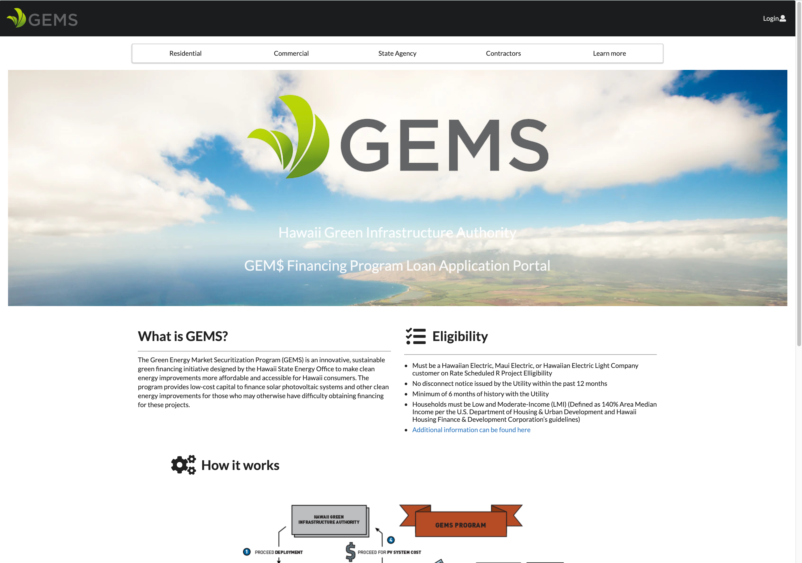

For the Hawaii Annual Code Challenge 2019, we created a loan portal for the GEM$ Hawaii program that would allow for an easier process of applying for loans to purchase solar panels. 

An overview of the project that explains the purpose and solution that we have provided is explained [here](https://green-loan-portal.github.io)

## Contributions

For the most part, a majority of my contributions consisted of things on the logistics side of the project. I have incorporated the same Agile project management practices to our own project, and have also made sure that we adhered to deadlines that were established by the code challenge committee. On the technical side, I have made a few improvements to the front end of the application, and added a few front end features to improve the user experience. I also did my best to use the things that I have learned from using Git to enhance our workflow, and helped clear code conflicts when changes were implemented to our main/working copy.

## Lessons learned

Honestly speaking, my biggest takeaway from this project was a solid grasp on collaboration workflows, and project management. Although I did a little bit of the technical stuff, I didn't really implement any of the fancy features like sending emails to the users, or converting their responses to PDF like my other team members did. However, I felt like I had a pretty good grasp on how we needed to use Git/Github to make our changes to our project and minimize any merge/code conflicts that could have occurred. I tried my best to ensure that there was a steady process for the other guys to follow so that they could only worry about writing code, and didn't have to waste time resolving merge conflicts when they saved their changes on our main code branch. 

If you would like to either see any source code, or see our project pages, you can go [here](https://github.com/green-loan-portal)