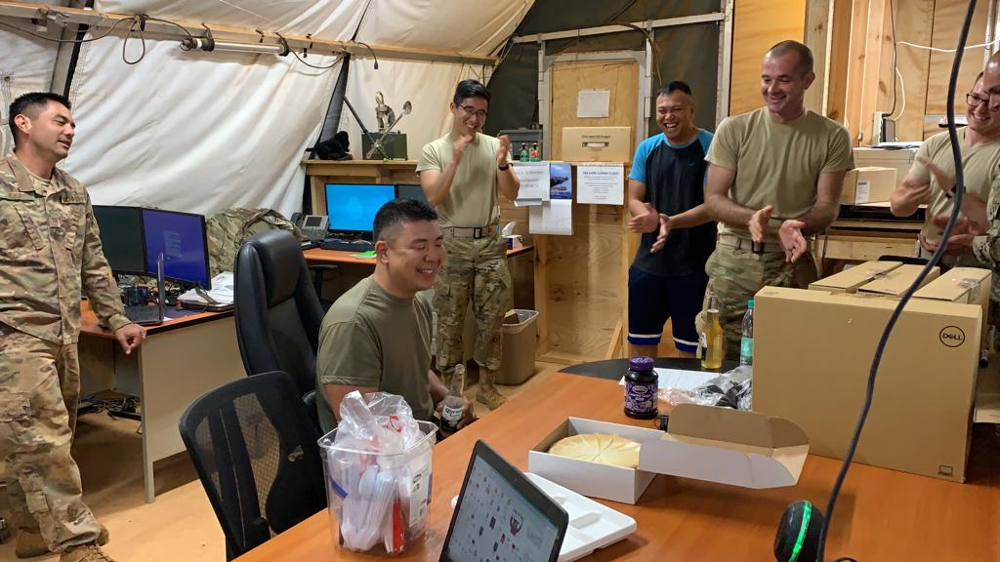

In November of last year, I was deployed to Africa with the Hawaii Air National Guard, and with 10 of my fellow Guardsmen to support operations that were going in within the area. A majority of my duties included providing help desk support to our numerous customers that reached out to us, but I was able to get my hands dirty with other things like System Administration, Networking, and Radio Frequency Transmission. Throughout my time in Africa, I participated in numerous projects, led a few initiatives, and managed/implemented new systems to improve our communications capability throughout the entire base, and entire area of operations. The timing of the deployment did not work out with my school schedule, so I had to unfortunately withdraw from my classes during the Fall 2018 semester, which included ICS 314. However, I definitely learned a lot throughout the deployment, both about things IT related, and about myself and how I work with others in a team environment. 

The biggest project that we had was our new server migration. When we first arrived, our old server equipment has been well beyond its end of life date, and was slowly dying on us. The people that we were replacing told us that there were multiple server failures as a result of the old equipment failure, and that it needed to be replaced as soon as possible. In addition to that, the entire infrastructure of the server was outdated, and was not in compliance with current standards that were established with Air Force guidance and policy. Because of this, this would be our first major project that we would have to attack. Throughout the project, my main role was to ensure that every client machine was in compliance with the administrative policies that were set by our new server stack. I had to go to each and every computer on our network, and run through a checklist/process that I created to ensure compliance. In addition to that, I was responsible for creating and maintaining user accounts on our network with Microsoft Active Directory, and also had a hand in managing our email (Microsoft Exchange) server. The preparation process took a few weeks, as the others that I was working with (network infrastructure, system administrators) also had things that they had to take care of before we officially switched to the new server stack. As the time got closer, I did everything I could to help out the others as much as I could as well. I ran cable with the network infrastructure guys, helped set up group policy and set up the email server with the system administrators (well, it was only one guy, so I tried my best to help out with whatever was on his plate), and even helped with setting up radio frequency antennas with our radio guys for our security forces. Since I was able to work with multiple areas of expertise, I was able to significantly expand my technical knowledge, and learned enough things to write a book. The subsequent projects also allowed me to learn other things like maintaining a generator, and operating a hydraulic tower.

However, technical knowledge wasn't the only thing that I learned/expanded throughout the duration of the deployment. Because I was pretty much the only one from my job that was deployed, I was also in charge of my section, which was just a one man section. I had to manage different processes for our projects, and provide input of what the role of my section would be, and how they would integrate into the project for maximum effectiveness. Managing myself allowed me to really understand how to evaluate the capabilities of my job, and how I could allow it to work with the other sections. I also evaluated how the other sections work, and what their capabilities were so that I could effectively apply my capabilities, and what tasks to either take from them, or leave to them. As a "section leader", it really allowed me to get some managing experience, and also allowed me to get a taste of what the supervisory/section leader level would feel like. 

Since we were a pretty small group, everyone had a lot on their plates, and there were definitely more long days than I could count. However, that didn't mean that we couldn't have fun while we were out there!

We played volleyball with the Germans...

Celebrated birthdays!