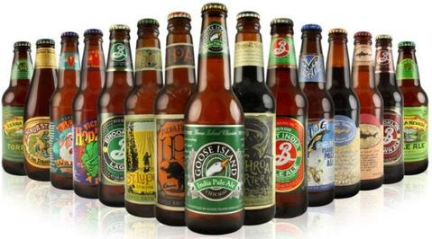

In our Introduction to Computer Science class, we began to explore various abstract data types and sorting methods that provided us with the foundation of how these data types were applied, and how these sorting algorithms were implemented. To do this, we were tasked with adding different kinds of beers to a list, and using the sorting algorithms to sort the beers in a given order (by type, individual bitter units, alcohol by volume). 

To accomplish this, we first had to make the different kinds of beers, that were represented by objects in Java. Each Java object was a different type of beer that had their own properties that determined how they were going to be sorted. This part of the assignemnt introduced us to object oriented programming. 

We also implemented some basic sorts (selection, insertion, and bubble sort) to get an introduction to sorting algorithms. We learned how the sorting algorithms work, and how they are implemented. 

Souce coude can be found [here](https://github.com/ryotabs/beersorter).
