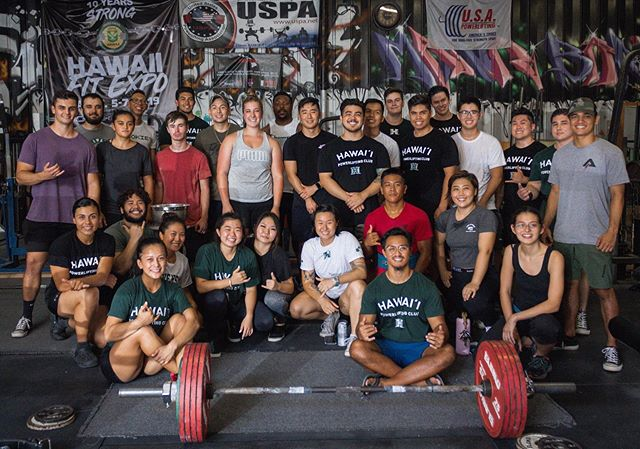

I started my lifting journey a few years ago when I finally decided that I was tired of always being called the skinny kid. I remember my humble beginnings at the 24 Hour Fitness in Maui, barely being able to bench press the bar. Now that I look back at it, I've come a far way! Honestly, lifting has probably taught me more and allowed me to learn a lot about myself more than any other thing that I've experienced, especially at an early point of my life (maybe my african adventure comes to a close second, you can read about it [here](https://ryotabs.github.io/projects/fun-in-the-sun)). 

